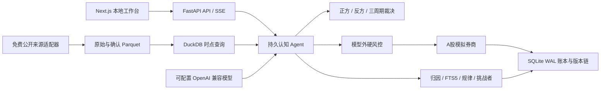
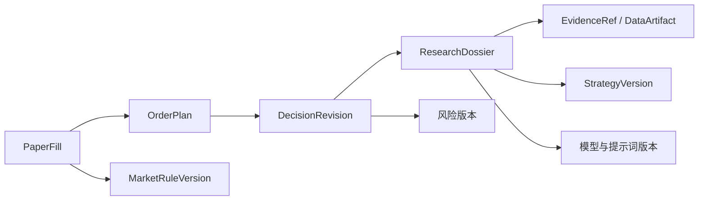

# 系统架构

## 设计边界

Alpha Sage 是本地 Modulith：一个 FastAPI 后端、一个 Next.js 前端、一个 SQLite 业务库以及本地 Parquet 数据目录。V1 不引入微服务、消息队列、外部向量数据库、因子平台或运行时代码生成链。

## 后端模块

| 模块 | 职责 |
|---|---|
| `services/providers.py` | Eastmoney、BaoStock、腾讯报价及腾讯不复权历史回退适配 |
| `services/market_adapter.py` | 市场、币种、时区、手数、最小价位、涨跌停、结算与带生效日费用规则 |
| `services/data_sync.py` | 日历、证券池、双源日线校验与 Parquet 封存 |
| `services/evidence.py` | 可信白名单 URL、HTML/PDF 原文封存和证据引用 |
| `services/agent.py` | 机会发现、正方、反方、综合、组合提案和修订链 |
| `services/risk.py` | 模型外仓位、行业、总仓位、周期预算和回撤门禁 |
| `services/broker.py` | 下一根完整 5 分钟行情、双源确认、费用、T+1 与模拟成交 |
| `services/evolution.py` | 到期归因、周度规律、冻结留出回放、影子期、晋升与回滚 |
| `services/scheduler.py` | 交易时段内调度；关闭补跑，避免休眠后补造成交 |

## 版本与追溯链

一笔成交可沿以下链路回溯：

`DecisionRevision`、研究档案、证据、成交、数据产物、经验、模型调用和审计事件均按追加式记录保护。策略版本不可删除，冠军变更必须经过人工批准或人工回滚。

## 多市场扩展

`MarketAdapter` 隔离市场代码、交易所时区、币种、结算、手数、最小价格变动、涨跌停和费用。未来接入港股、美股或加密资产时，应新增适配器和规则版本，不修改 A 股历史事实或复用不兼容的成交假设。
